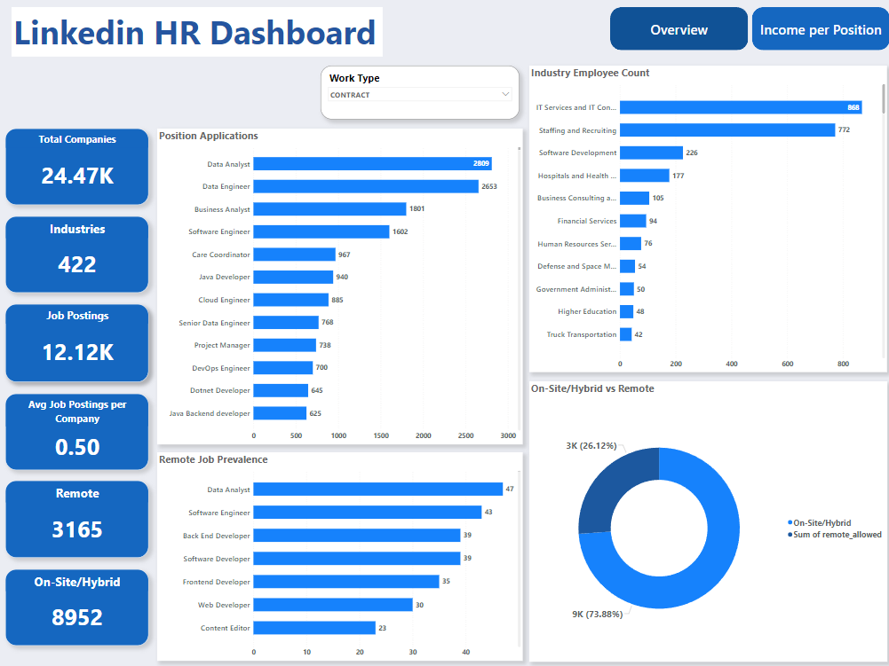
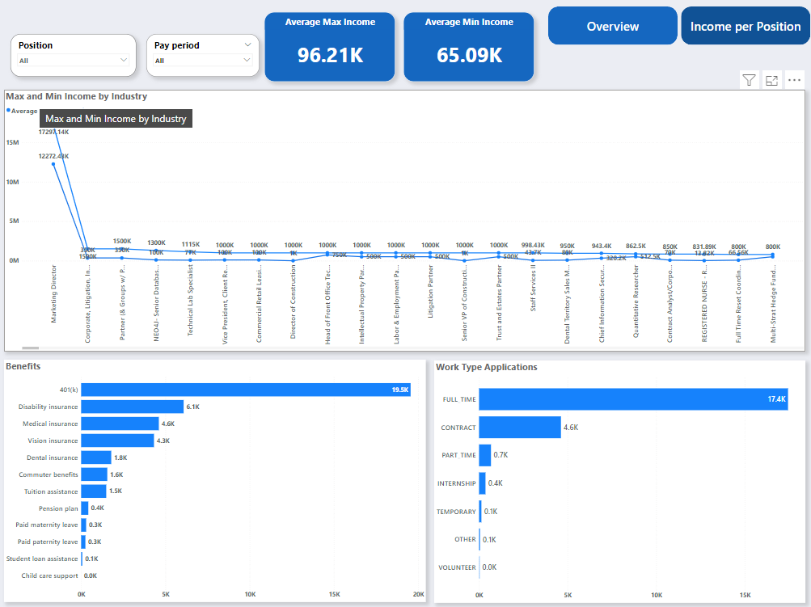

# LinkedIn data project in PowerBI

This project is to apply skills developed through the Datová Akademie course offered by Engeto Academy using a real-world problem. 

# Objective:

The dataset, sourced from Kaggle - "LinkedIn Job Postings (2023-2024)", is used in the project to analyze LinkedIn job-related data in Power BI, with a focus on job postings, application work types, income by industry, position applications, and industry employee counts.

# Tools Used:

- Power BI;
- Power Query;
- Dax Query.

# Key Questions:

- How many companies and industries are represented on LinkedIn during the years 2023-2024?
- How many job postings include remote or on-site positions, and what is the average number of job postings per company?
- What are the maximum and minimum average salaries for employees in different positions?
- Which industry has the highest employee count?
- Which position receives the most applications on LinkedIn?

# Visualization

